# Laboratorios de EDA y preprocesamiento en Amazon SageMaker

**Estudiante:** Santiago Perez Garzon  
**Curso:** Machine Learning Foundations  
**Entorno:** AWS Academy, Amazon SageMaker AI y JupyterLab  
**Región:** `us-east-1`

## Objetivo

Desarrollar un flujo reproducible de análisis exploratorio de datos y preprocesamiento básico: cargar datos reales, revisar su estructura y calidad, generar visualizaciones, estudiar correlaciones y convertir variables categóricas a representaciones numéricas aptas para aprendizaje automático.

## Evidencia de acceso y configuración

El laboratorio se inició desde AWS Academy con las credenciales institucionales. La instancia principal del laboratorio 3.1 se configuró como `MyNotebook`, tipo `ml.m5.xlarge`, plataforma Amazon Linux 2023, volumen de 5 GB, rol de ejecución suministrado por el laboratorio y ciclo de vida `ml-pipeline`. Antes de abrir JupyterLab se verificó el estado `InService`.

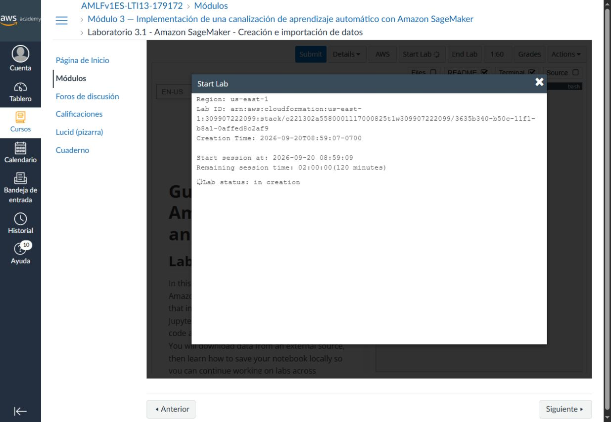

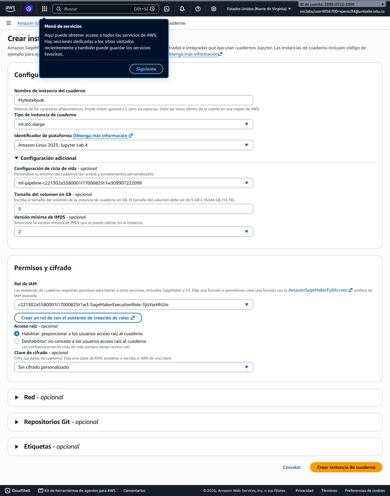

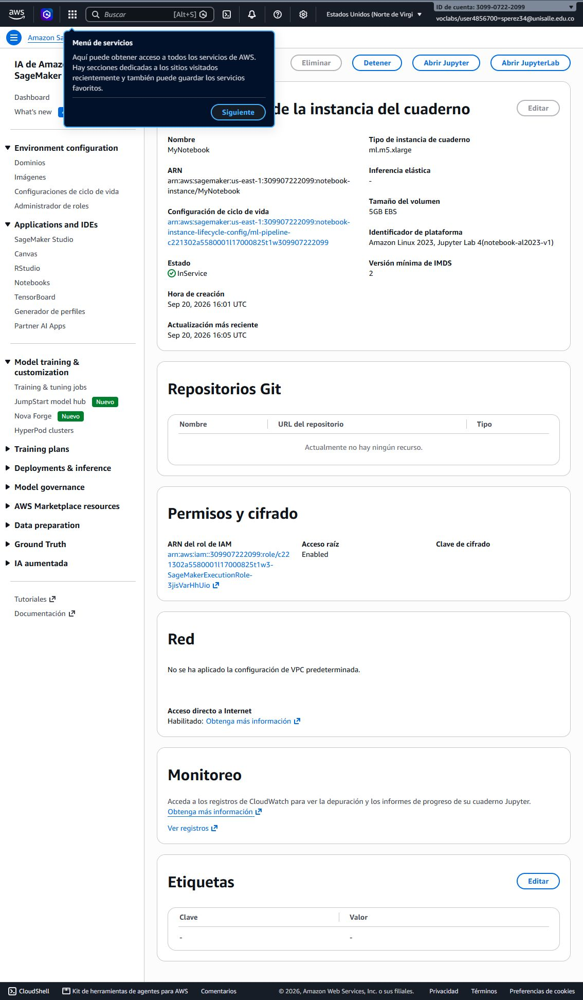

## Laboratorio 3.1: creación e importación de datos

### Tarea 1: instancia de SageMaker

Se creó y verificó la instancia administrada para disponer de un kernel, almacenamiento temporal y los notebooks proporcionados por AWS Academy. La descripción técnica quedó en [`docs/3_1_tarea_1.md`](docs/3_1_tarea_1.md).

### Tarea 2: guía de Python y JupyterLab

Se trabajó la guía `PythonCheatSheet`, combinando Markdown, código, tipos de datos, control de flujo y operaciones tabulares. El nombre completo se agregó al inicio y la ejecución se realizó con un kernel de Python compatible.

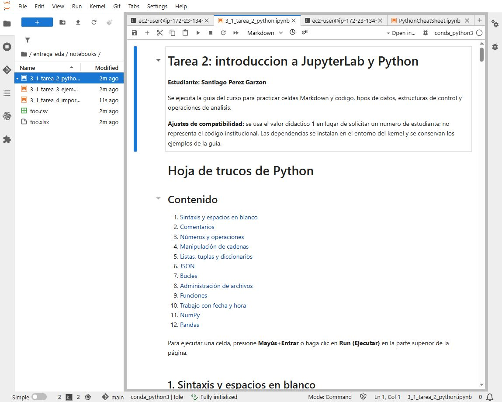

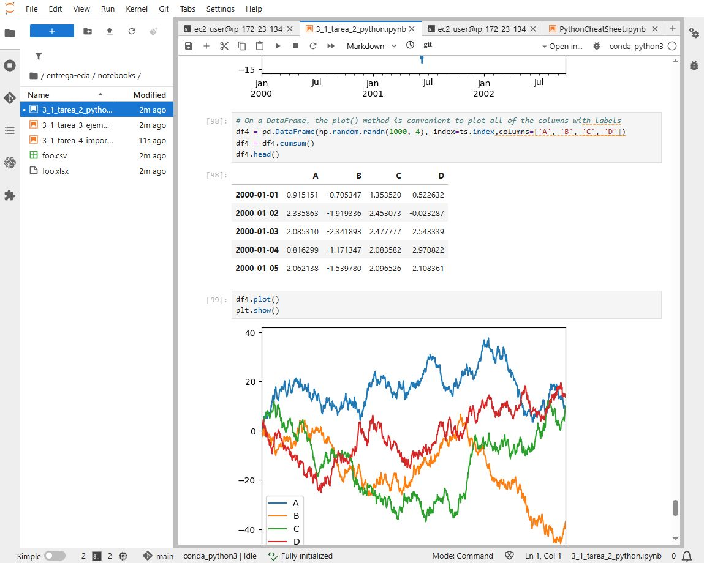

Notebook: [`notebooks/3_1_tarea_2_python.ipynb`](notebooks/3_1_tarea_2_python.ipynb)

### Tarea 3: inspección del ejemplo MNIST

Se abrió `linear_learner_mnist.ipynb` y se identificó el flujo de preparación, carga a S3, entrenamiento con Linear Learner, despliegue y evaluación. De acuerdo con la guía, el ejemplo se inspeccionó sin ejecutarlo porque depende de recursos externos de S3.

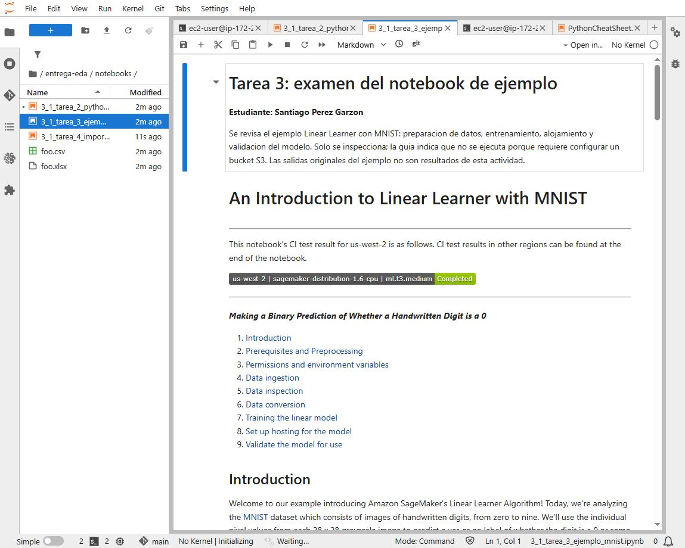

Notebook: [`notebooks/3_1_tarea_3_ejemplo_mnist.ipynb`](notebooks/3_1_tarea_3_ejemplo_mnist.ipynb)

### Tarea 4: importar Vertebral Column

Se descargó el archivo ZIP del repositorio UCI mediante HTTPS, se inspeccionaron las versiones DAT y ARFF y se cargó `column_2C_weka.arff` con SciPy y pandas. La validación confirmó:

- 310 observaciones y 7 columnas.
- Seis variables numéricas y una etiqueta de clase.
- Cero valores faltantes.
- 210 registros `Abnormal` y 100 registros `Normal`.

Notebook: [`notebooks/3_1_tarea_4_importacion.ipynb`](notebooks/3_1_tarea_4_importacion.ipynb)

### Tarea 5: conservación

Los notebooks se guardaron con sus salidas y se versionaron antes de abandonar el entorno temporal. La explicación está en [`docs/3_1_tarea_5.md`](docs/3_1_tarea_5.md).

## Laboratorio 3.2: exploración de datos

### Tarea 1: acceso al entorno

Se inició el entorno independiente del laboratorio, se comprobó `MyNotebook` en estado `InService` y se abrió JupyterLab. Esto quedó documentado en [`docs/3_2_tarea_1.md`](docs/3_2_tarea_1.md).

### Tarea 2: EDA del conjunto Vertebral Column

El notebook oficial se ejecutó completo: **52 celdas y cero errores**. Se revisaron dimensiones, tipos, estadísticas descriptivas, distribución de la clase, valores atípicos, histogramas, diagramas de caja, dispersión y matriz de correlación.

Los hallazgos principales fueron:

- El conjunto conserva 310 filas y 7 columnas.
- La clase está desbalanceada aproximadamente 2:1: 210 casos anormales y 100 normales.
- `degree_spondylolisthesis` presenta valores extremos y la relación lineal positiva más alta con la clase, aproximadamente `0.44`.
- `pelvic_incidence` tiene correlación positiva aproximada de `0.35` con la clase.
- `pelvic_radius` tiene una relación negativa aproximada de `-0.31` con la clase.
- Las correlaciones orientan el análisis, pero no prueban causalidad ni sustituyen la validación de un modelo.

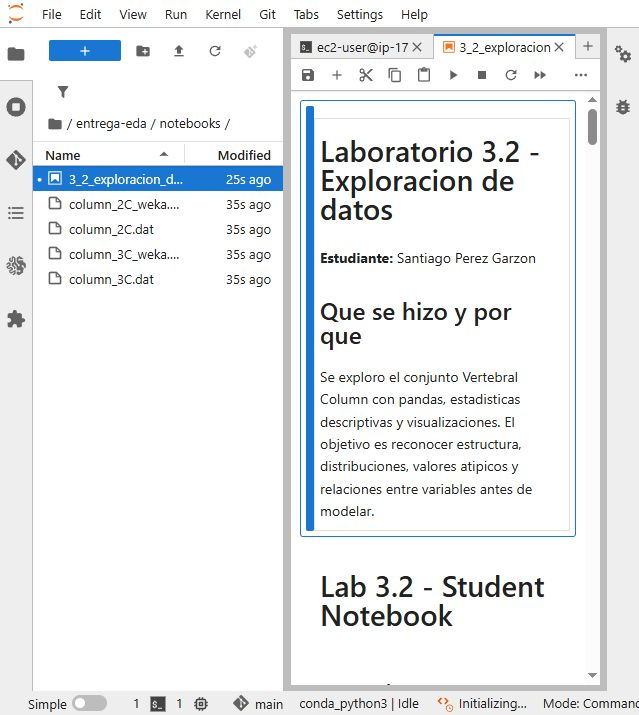

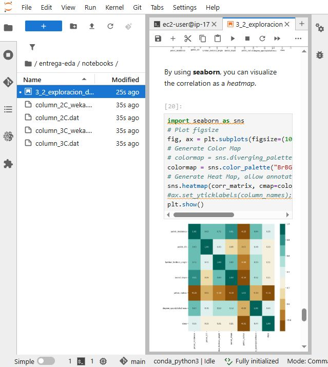

Notebook: [`notebooks/3_2_exploracion_datos.ipynb`](notebooks/3_2_exploracion_datos.ipynb)

## Laboratorio 3.3: codificación de datos categóricos

### Tarea 1: acceso al entorno

Se inició una nueva instancia temporal, se verificó su estado y se preparó JupyterLab para trabajar con el conjunto Automobile. La explicación está en [`docs/3_3_tarea_1.md`](docs/3_3_tarea_1.md).

### Tarea 2: variables ordinales y nominales

El notebook oficial se ejecutó completo: **53 celdas y cero errores**. El conjunto Automobile contiene 205 filas y 25 atributos antes de seleccionar las variables de trabajo. Se aplicaron dos estrategias:

- **Codificación ordinal:** `num-of-doors` y `num-of-cylinders` se transformaron a valores numéricos respetando su orden natural.
- **Codificación nominal:** `drive-wheels` y `aspiration` se transformaron en columnas indicadoras. Así se evita imponer una jerarquía inexistente entre categorías como `4wd`, `fwd` y `rwd`.

El resultado final conserva las categorías originales para comparación e incorpora columnas como `doors`, `cylinders`, `drive-wheels_4wd`, `drive-wheels_fwd`, `drive-wheels_rwd` y `aspiration_turbo`.

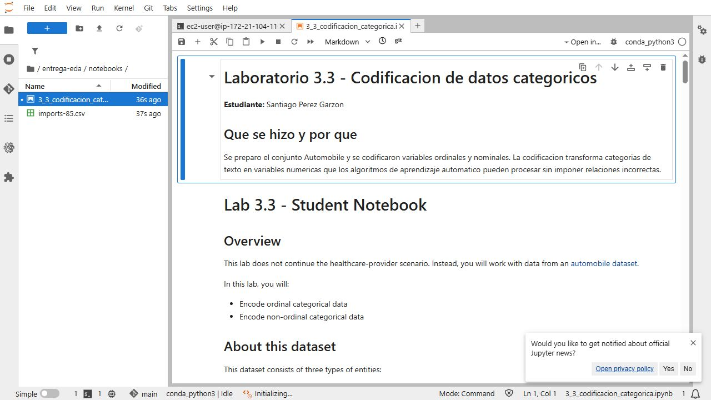

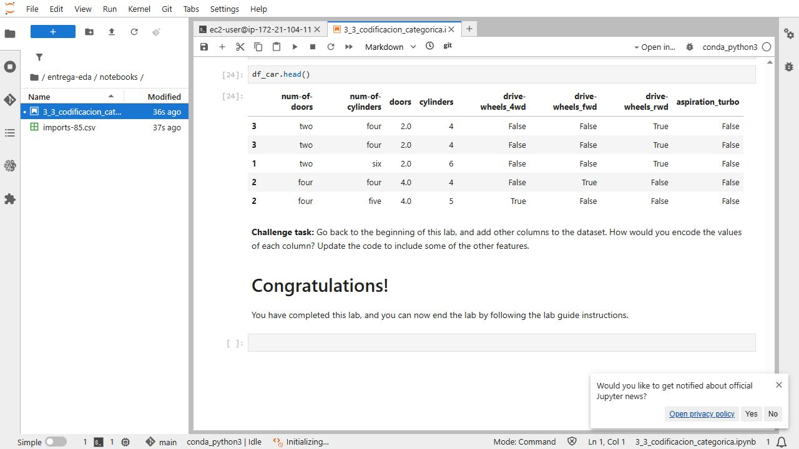

Notebook: [`notebooks/3_3_codificacion_categorica.ipynb`](notebooks/3_3_codificacion_categorica.ipynb)

## Gestión del repositorio

El historial separa las tareas para que cada cambio pueda revisarse y recuperarse de forma independiente. Los commits de los laboratorios 3.2 y 3.3 se generaron dentro de sus respectivas instancias de SageMaker y se conservaron mediante bundles de Git.

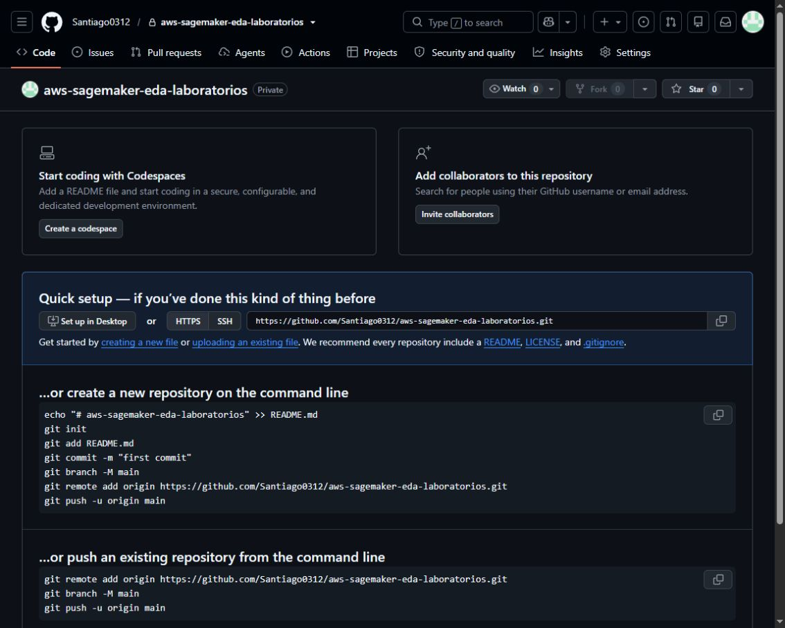

## Estructura

```text
.
├── README.md
├── docs/
│   ├── 3_1_tarea_1.md
│   ├── 3_1_tarea_5.md
│   ├── 3_2_tarea_1.md
│   ├── 3_2_tarea_2.md
│   ├── 3_3_tarea_1.md
│   └── 3_3_tarea_2.md
├── notebooks/
│   ├── 3_1_tarea_2_python.ipynb
│   ├── 3_1_tarea_3_ejemplo_mnist.ipynb
│   ├── 3_1_tarea_4_importacion.ipynb
│   ├── 3_2_exploracion_datos.ipynb
│   └── 3_3_codificacion_categorica.ipynb
└── evidencias/
    └── capturas del acceso, configuración, ejecución y resultados
```

## Reflexión final

El laboratorio mostró que un análisis útil comienza antes de entrenar un modelo. Primero es necesario verificar de dónde provienen los datos, su forma, sus tipos y la presencia de valores faltantes. Las estadísticas y visualizaciones ayudaron a detectar desbalance, valores extremos y relaciones que no son evidentes al observar una tabla.

También fue importante distinguir entre categorías ordinales y nominales. Convertir texto a números sin analizar su significado puede introducir relaciones falsas; por eso se usó una asignación ordenada cuando existe jerarquía y variables indicadoras cuando las categorías solo representan nombres diferentes. SageMaker facilitó la ejecución reproducible, mientras que Git permitió conservar evidencia y recuperar el trabajo de instancias temporales.

Como mejora futura, se podría comparar el desempeño de varios modelos con y sin los valores extremos, aplicar particiones estratificadas por el desbalance de la clase y construir una canalización que automatice la validación y la codificación para evitar diferencias entre entrenamiento e inferencia.

## Uso ético de la inteligencia artificial

Durante el desarrollo se utilizó inteligencia artificial como apoyo para organizar la entrega, mejorar la redacción y revisar la claridad de las explicaciones. Los procedimientos, resultados y evidencias fueron verificados en el entorno del laboratorio. El estudiante conserva la responsabilidad sobre el contenido presentado, su comprensión y su uso académico.
